# Essay Coach Tutorial

A complete guide to using and understanding Essay Coach — the local web app that helps university students improve essay answers through structured AI feedback.

---

## Table of Contents

### Part 1: User Guide
- [Quick Setup](#quick-setup)
- [For Instructors](#for-instructors)
  - [First-Time Setup: Creating Your Account](#first-time-setup-creating-your-account)
  - [Signing In](#signing-in)
  - [Managing Classes](#managing-classes)
  - [Creating a Question](#creating-a-question)
  - [Writing a Good Model Answer](#writing-a-good-model-answer)
  - [Writing an Effective Rubric](#writing-an-effective-rubric)
  - [Editing and Deleting Questions](#editing-and-deleting-questions)
  - [Viewing Analytics](#viewing-analytics)
    - [Exporting Data](#exporting-data)
  - [Managing the Invite Code](#managing-the-invite-code)
  - [Signing Out](#signing-out)
- [For Students](#for-students)
  - [Entering Your Class Code](#entering-your-class-code)
  - [Selecting a Question](#selecting-a-question)
  - [Writing and Submitting Your Answer](#writing-and-submitting-your-answer)
  - [Reading Your Feedback](#reading-your-feedback)
  - [Revising Your Answer](#revising-your-answer)
  - [Using Revision History](#using-revision-history)

### Part 2: Developer Guide
- [Architecture Overview](#architecture-overview)
- [Project Structure](#project-structure)
- [File-by-File Breakdown](#file-by-file-breakdown)
- [The Feedback Engine](#the-feedback-engine)
- [Security Model](#security-model)
- [Database Schema](#database-schema)
- [API Reference](#api-reference)
- [Frontend Architecture](#frontend-architecture)
- [Extending the App](#extending-the-app)

### Part 3: Development History
- [Phase 1 — Core App](#phase-1--core-app)
- [Phase 2 — Instructor Authentication](#phase-2--instructor-authentication)
- [Phase 3 — Classes](#phase-3--classes)
- [Phase 4 — Quantitative Scoring](#phase-4--quantitative-scoring)
- [Phase 5 — Per-Student Analytics](#phase-5--per-student-analytics)
- [Phase 6 — Analytics Export](#phase-6--analytics-export)
- [Phase 7 — Student Accounts](#phase-7--student-accounts)
- [Phase 8 — Multiple Student Sessions](#phase-8--multiple-student-sessions)
- [Phase 9 — Production Deployment](#phase-9--production-deployment)

---

# Part 1: User Guide

## Quick Setup

### Local development

You need Python 3.9+ and either an Anthropic API key or a running [Ollama](https://ollama.com) instance.

```bash
# Clone or navigate to the project
cd essay-coach

# Install dependencies
pip install -r requirements.txt

# Configure your environment
cp .env.example .env
```

Open `.env` and configure it:

**Option A — Anthropic Claude API (default)**
```
LLM_BACKEND=anthropic
ANTHROPIC_API_KEY=sk-ant-api03-your-key-here
```
You can get an API key at [console.anthropic.com](https://console.anthropic.com). The Anthropic API has its own billing — it is separate from a Claude Pro subscription.

**Option B — Local Ollama**
```
LLM_BACKEND=ollama
OLLAMA_BASE_URL=http://localhost:11434
OLLAMA_MODEL=llama3.3:70b
```
Install Ollama from [ollama.com](https://ollama.com) and pull your chosen model (`ollama pull llama3.3:70b`) before starting the app.

Start the server:

```bash
python app.py
```

The app runs at **http://localhost:8000**. Open it in your browser.

- **Students** go to: `http://localhost:8000/student`
- **Instructors** go to: `http://localhost:8000/instructor` (login required)

### Production deployment (Docker)

For a production deployment (PostgreSQL + Nginx reverse proxy):

```bash
cp .env.example .env   # fill in all credentials
docker compose up -d
```

To also run a local Ollama instance:
```bash
docker compose --profile ollama up -d
```

See [Architecture Overview](#architecture-overview) and [Extending the App](#extending-the-app) for deployment details.

---

## For Instructors

The instructor dashboard is protected by login. Instructors must create an account before they can access it.

### First-Time Setup: Creating Your Account

1. Start the server (`python app.py`).
2. Get the invite code the server generated on first startup:

   ```bash
   sqlite3 essay_coach.db "SELECT value FROM settings WHERE key='invite_code';"
   ```

3. Navigate to `http://localhost:8000/register`.
4. Enter a username, a password (8–72 characters), and the invite code from step 2.
5. Click **Create Account**. You'll be redirected to the instructor dashboard.

The invite code prevents unauthorized registrations. You can view and rotate it any time from the Settings section of the dashboard (see [Managing the Invite Code](#managing-the-invite-code)).

Additional instructors can register using the same invite code. Once registered, they can join your classes using the per-class instructor invite code (see [Managing Classes](#managing-classes)).

### Signing In

Navigate to `http://localhost:8000/instructor`. If you're not logged in, you'll be redirected to `/login` automatically. Enter your username and password and click **Sign In**.

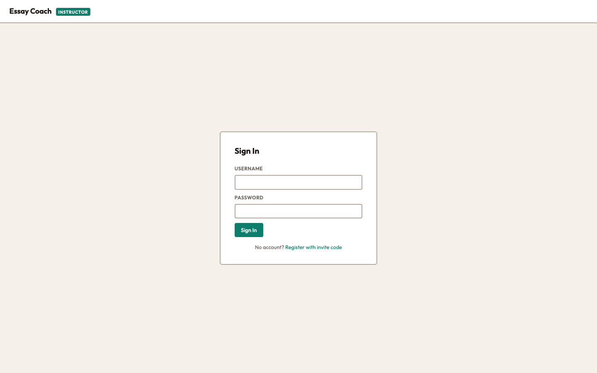

### Managing Classes

Classes are the top-level organizing unit. Each class has its own set of questions and two access codes: one for students and one for instructors to join.

#### Creating a Class

1. Click **Manage Classes** in the top navigation of the instructor dashboard.
2. Under **Create Class**, enter a name (e.g., "BIO101 Spring 2026") and click **Create**.
3. The class appears in the list with its **Student Code** and **Instructor Invite Code**.

#### Sharing Access

- **Student Code** (8 characters): Share this with your students. They enter it at `http://localhost:8000/student` to access the class question list.
- **Instructor Invite Code** (8 characters): Share this with co-instructors who already have an instructor account. They click **Join a Class** on the Manage Classes page and enter this code.

You can rotate either code at any time by clicking **Rotate** next to it. The old code stops working immediately.

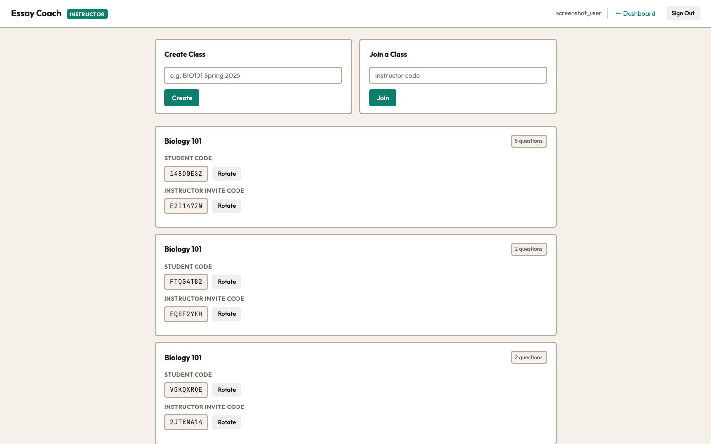

#### Joining an Existing Class

If another instructor created a class and shared the instructor invite code with you, click **Join a Class** on the Manage Classes page, enter the code, and click **Join**. The class and all its questions will then appear in your dashboard.

### Creating a Question

1. Navigate to `http://localhost:8000/instructor`.

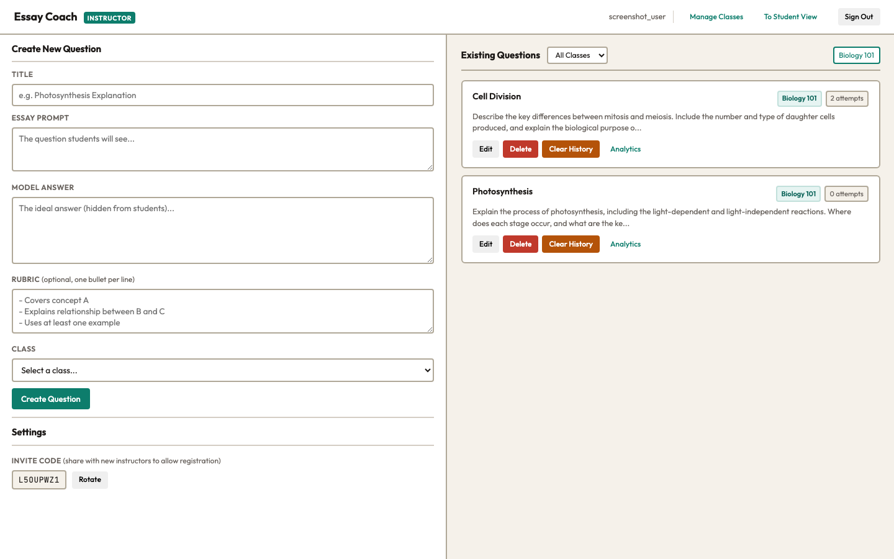

2. On the left side, fill in the **Create New Question** form:

| Field | Required | Description |
|-------|----------|-------------|
| **Title** | Yes | A short name for the question (e.g., "Photosynthesis"). Students see this when picking a question. |
| **Essay Prompt** | Yes | The full question text students will read and respond to. Be specific about what you want them to cover. |
| **Model Answer** | Yes | Your ideal answer. Students **never** see this — it is used only by the AI to judge how close the student's answer is. |
| **Rubric** | No | Optional grading criteria, one bullet point per line. Helps the AI focus its feedback on what matters most to you. |
| **Class** | Yes | Which class this question belongs to. Only your classes appear in this list. Create a class first if none exist. |

3. Click **Create Question**. The question appears immediately in the "Existing Questions" list on the right, tagged with a class badge.

### Writing a Good Model Answer

The model answer is the most important field. It directly shapes the quality of AI feedback. Tips:

- **Be comprehensive.** Include every concept, argument, and detail you'd expect in an A-grade answer. The AI uses this as the benchmark — anything missing from the model answer won't be flagged as missing from the student's answer.
- **Be specific.** Vague model answers produce vague feedback. If you want students to mention a particular mechanism, study, or relationship, include it.
- **Write in prose.** The AI compares the student's essay against your answer, so writing in full sentences (rather than bullet points) helps it assess depth and structure more accurately.
- **Don't worry about perfection.** The AI never quotes or paraphrases the model answer to students. It uses it as a reference, not a script.

**Write one idea per paragraph, separated by blank lines.** The scoring engine splits the model answer on blank lines, so paragraph breaks are structurally important — not just stylistic. Each paragraph becomes one scoreable unit.

**Example model answer for a Photosynthesis question:**

```
Photosynthesis is the process by which plants, algae, and some bacteria convert
light energy into chemical energy stored in glucose. It occurs in two stages:
light-dependent reactions in the thylakoid membranes and the Calvin cycle in
the stroma.

In the light reactions, water is split, oxygen is released, and ATP and NADPH
are produced. The Calvin cycle uses CO2, ATP, and NADPH to synthesize glucose
through carbon fixation.

Chlorophyll absorbs light primarily in the blue and red wavelengths, reflecting
green. Photosynthesis is fundamental to life as it produces oxygen and is the
basis for most food chains and aerobic life.
```

#### Adding Point Values for Quantitative Scoring (optional)

You can optionally assign point values to paragraphs in your model answer by appending `[N]` (where N is a positive integer) at the end of a paragraph. When present, students receive a numeric score after each submission.

**Blank lines between paragraphs are required for scoring to work.** The scoring engine splits the model answer on blank lines — if two paragraphs run together without a blank line between them, they are treated as one section.

**Example with scoring:**

```
Photosynthesis is the process by which plants, algae, and some bacteria convert
light energy into chemical energy stored in glucose. It occurs in two stages:
light-dependent reactions in the thylakoid membranes and the Calvin cycle in
the stroma. [3]

In the light reactions, water is split, oxygen is released, and ATP and NADPH
are produced. The Calvin cycle uses CO2, ATP, and NADPH to synthesize glucose
through carbon fixation. [4]

Chlorophyll absorbs light primarily in the blue and red wavelengths, reflecting
green. Photosynthesis is fundamental to life as it produces oxygen and is the
basis for most food chains and aerobic life. [3]
```

This assigns 3, 4, and 3 points to the three paragraphs (10 total). After each submission, students see a score breakdown — how many points they earned per section and their total out of 10.

You can mix scored and unscored paragraphs. Paragraphs without a `[N]` marker are used for qualitative feedback only. If no paragraphs have point values, no score is shown.

### Writing an Effective Rubric

The rubric is optional but recommended. It tells the AI which aspects of the answer matter most. Format it as one bullet point per line:

```
- Describes both light-dependent and light-independent reactions
- Mentions the role of chlorophyll in light absorption
- Explains oxygen as a byproduct
- Discusses significance for food chains and aerobic life
```

Tips:
- Keep each bullet focused on one concept or skill.
- Use action verbs: "Describes...", "Explains...", "Compares...", "Evaluates..."
- You don't need to cover everything — the AI also uses the model answer. The rubric just emphasizes your priorities.
- If you skip the rubric entirely, the AI still works fine — it just relies entirely on the model answer.

### Editing and Deleting Questions

Each question card in the "Existing Questions" list has two buttons:

- **Edit**: Loads the question's data (including the model answer, rubric, and class assignment) back into the form on the left. Make your changes and click **Update Question**. Click **Cancel** to discard changes.

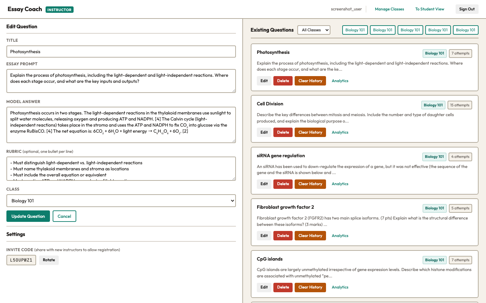

- **Delete**: Permanently removes the question and all associated student attempts. You'll get a confirmation dialog first.

### Viewing Analytics

Each question card shows:
- A **class badge** indicating which class the question belongs to.
- An **attempt count** (e.g., "5 attempts") — the total number of student submissions across all sessions.
- An **Analytics** button that goes directly to the per-question session detail page.

Use the **class filter** dropdown above the question list to view only questions from a specific class. Below the dropdown, a row of class links lets you jump to the class-level analytics summary for any of your classes.

#### Class Analytics Summary

Click a class analytics link (or the **Analytics** button on any question card) to reach the class summary page at `/instructor/classes/{class_id}/analytics`. It shows one row per question with:

| Column | Description |
|--------|-------------|
| **Sessions** | Number of distinct student browsers that submitted at least one attempt. |
| **Avg attempts** | Mean number of attempts per session. |
| **Avg score** | Mean final score across sessions (e.g., `7.1 / 10`). Shown only for scored questions; `—` otherwise. |
| **Score distribution** | A color-coded bar split into red (< 40%), yellow (40–69%), and green (≥ 70%) segments, proportional to the number of sessions in each band. |

Click **View →** on any row to drill into that question's session detail.

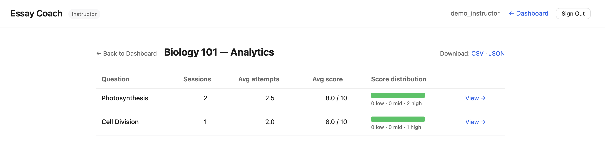

#### Per-Question Session Detail

The question detail page at `/instructor/analytics/{question_id}` shows one row per student session, sorted by most attempts first (most engaged students at the top). Three stat tiles at the top summarize the question overall: total sessions, average attempts, and average final score.

Each row shows:
- A truncated session ID (first 4 and last 4 characters of the UUID)
- Attempt count
- Score progression — the score earned on each attempt, joined with `→`, with the final value bolded (e.g., `5 → 7 → **9**`). Shows `—` for unscored questions.
- Final score, color-coded green/yellow/red by the same thresholds as the distribution bar.

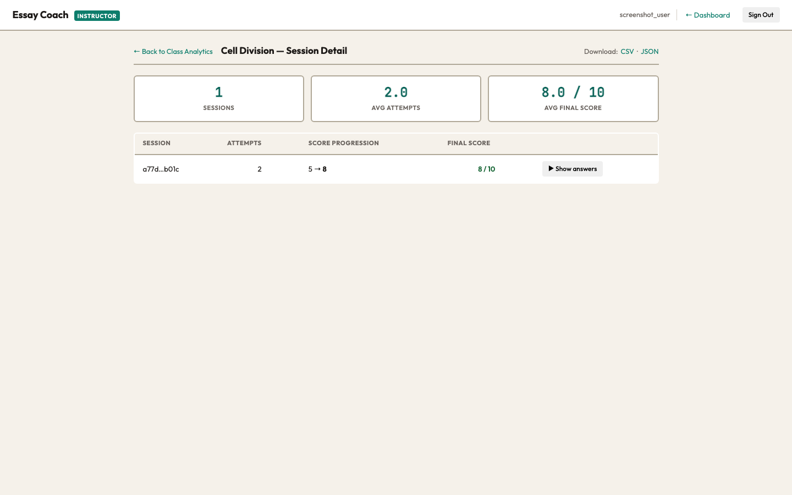

Click **▶ Show answers** on any row to expand an inline panel showing each attempt's answer text. The AI's qualitative feedback is shown below the final attempt's answer.

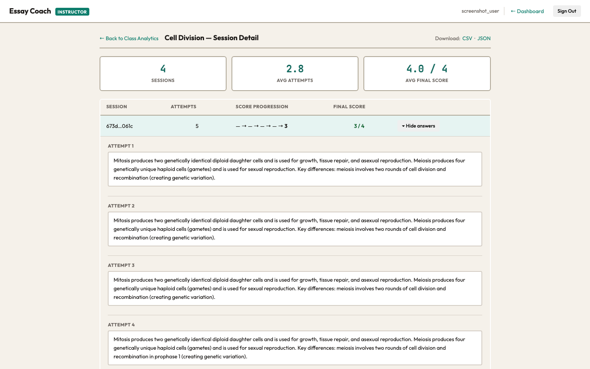

#### Exporting Data

Both analytics pages have **Download** links in the top-right corner of the header (visible only when data exists). Click **CSV** or **JSON** to download:

- **Class analytics page** — one row per student session across all questions, with columns: `question_title`, `session_id`, `attempt_count`, `final_score`, `max_score`.
- **Question detail page** — one row per attempt, with columns: `session_id`, `attempt_number`, `student_answer`, `feedback`, `score_awarded`, `max_score`.

Unscored questions have empty cells for score columns rather than null values, so the files open cleanly in Excel or Google Sheets without mixed-type columns.

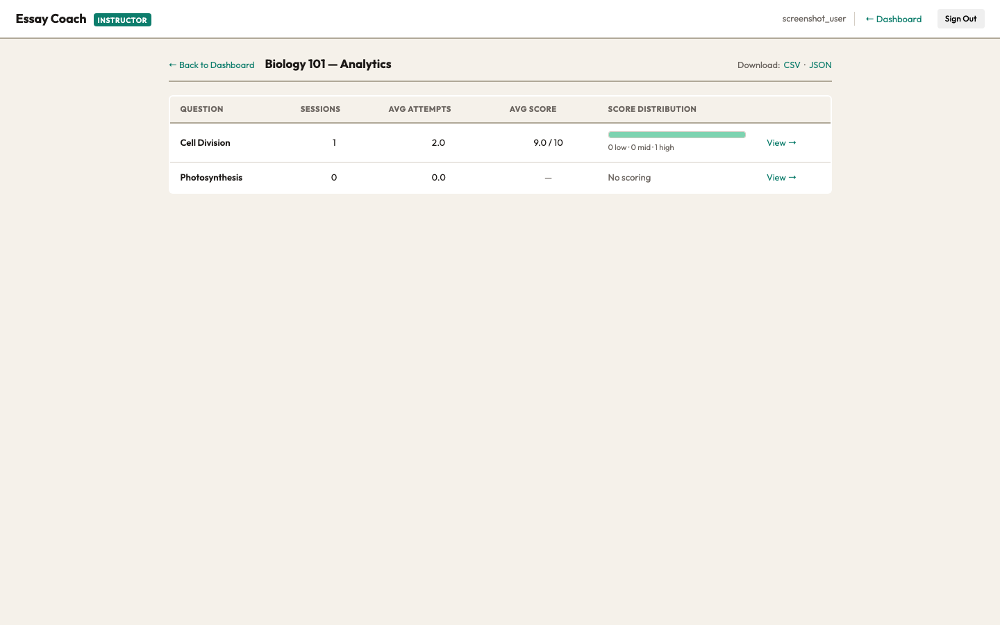

### Managing the Invite Code

The Settings section at the bottom of the instructor dashboard shows the current **instructor registration invite code**. This is separate from per-class codes — it gates who can create an instructor account in the first place.

Share this code with anyone who should be able to register as an instructor. To generate a new code, click **Rotate**. The old code stops working immediately.

You can also view the current code from the command line:

```bash
sqlite3 essay_coach.db "SELECT value FROM settings WHERE key='invite_code';"
```

### Signing Out

Click **Sign Out** in the top-right of the instructor dashboard. Your session is ended and you'll be redirected to the login page.

---

## For Students

### Creating an Account (Optional)

When you navigate to `http://localhost:8000/student`, you'll first see an auth panel. You can:

- **Sign in** — enter your username and password, then click **Sign in**.
- **Create account** — enter a username, email, and password (minimum 8 characters), then click **Create account**.
- **Continue anonymously** — click the "Continue anonymously" link to skip login.

If you create an account, your revision history is tied to your login and persists across browsers and devices. Anonymous use is fully supported but history is stored only in the current browser's local storage — clearing browser data loses it.

### Entering Your Class Code

After signing in (or choosing anonymous), you'll be prompted for your class code.

1. Enter the 8-character code your instructor gave you (not case-sensitive — the app uppercases it automatically).
2. Click **Continue**. If the code is valid, you'll be taken to your class's question list. If not, an error message appears.

Your class is remembered in your browser. On your next visit, you'll be taken directly to the question list without re-entering the code.

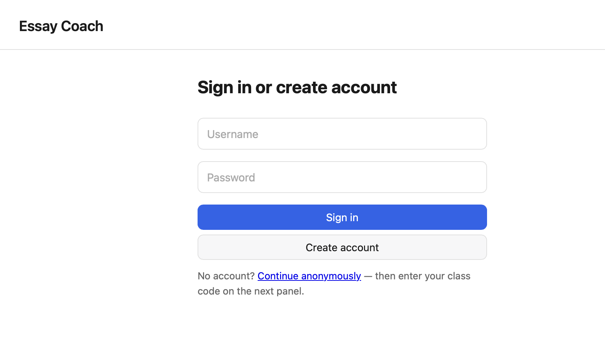

To switch to a different class, click **Switch class** in the top navigation. This clears the stored class and returns you to the code entry form.

### Selecting a Question

Once inside your class, you'll see the list of available questions.

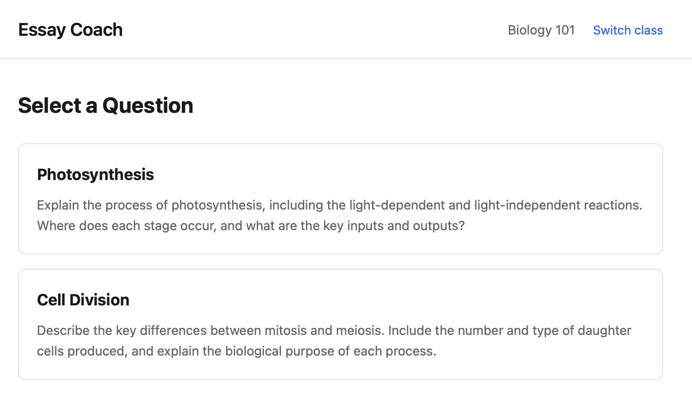

Each card shows the question title and a preview of the essay prompt. Click a question to open the writing workspace.

### Writing and Submitting Your Answer

The workspace is a split-screen layout:

- **Left pane**: The essay prompt at the top, and a large text area below for your answer.
- **Right pane**: Where feedback appears after you submit.

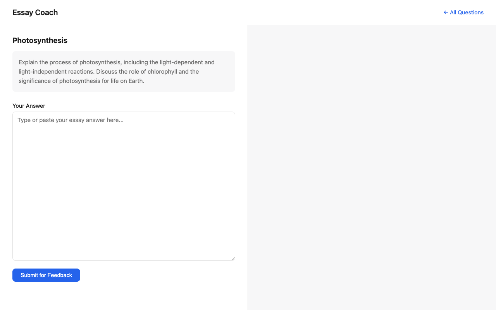

Write or paste your answer into the text area, then click **Submit for Feedback**.

While the AI analyzes your answer, you'll see a pulsing dot with "Analyzing your answer..." The feedback streams in word-by-word in real time — you can start reading before it finishes.

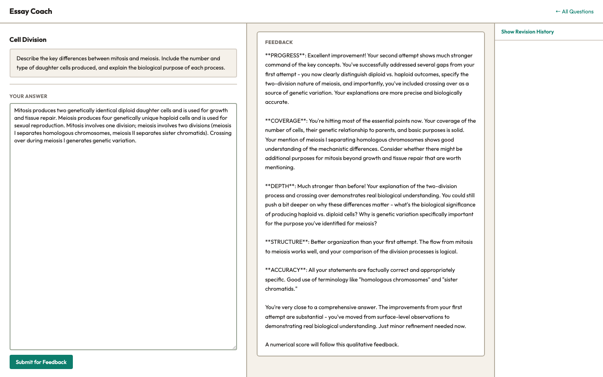

### Reading Your Feedback

Feedback is structured into sections:

| Section | What It Tells You |
|---------|-------------------|
| **Coverage** | Which key concepts or arguments are present, partially addressed, or missing. The AI gives directional hints ("consider whether your discussion of X is complete") rather than revealing what the answer should say. |
| **Depth** | Where your reasoning could go deeper — areas where you've stated a fact but haven't explained the mechanism, significance, or connection. |
| **Structure** | How to improve the organization of your argument — paragraph ordering, transitions, logical flow. |
| **Accuracy** | Any factual errors or misconceptions the AI detected. |
| **Progress** | (Attempt 2 and later) What improved since your last attempt and what still needs work. |

The AI **never** reveals the instructor's model answer — it's designed to guide you toward discovering the shape of a good answer through your own thinking.

#### Score (optional)

If the instructor added point values to their model answer, a score table appears below the feedback after each submission. It shows:

- Each scored section with points earned out of the section total
- Your overall total (e.g., **7 / 10**)

Scores are stored with each attempt and visible in your revision history.

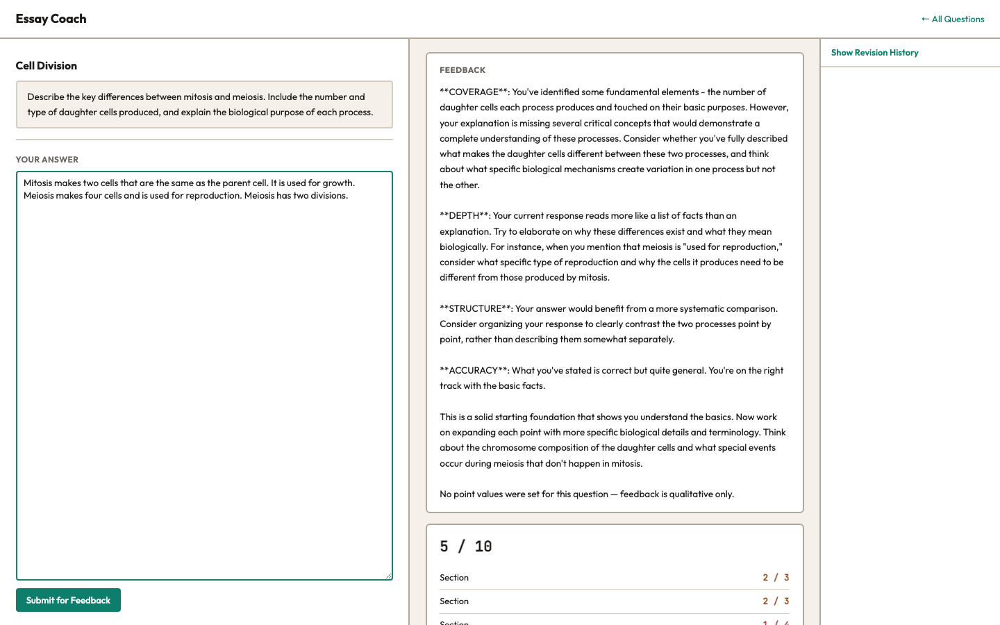

### Revising Your Answer

After reading the feedback:

1. Edit your answer in the text area (your previous text is still there).
2. Click **Submit for Feedback** again.
3. The attempt counter increments. The AI sees your revision history and adjusts its feedback:
   - **Early attempts** get broad guidance.
   - **Later attempts** get more targeted, specific nudges.
   - If your answer is very close to the model answer, the AI will say so and suggest minor polish.

There is no limit on how many times you can revise and resubmit.

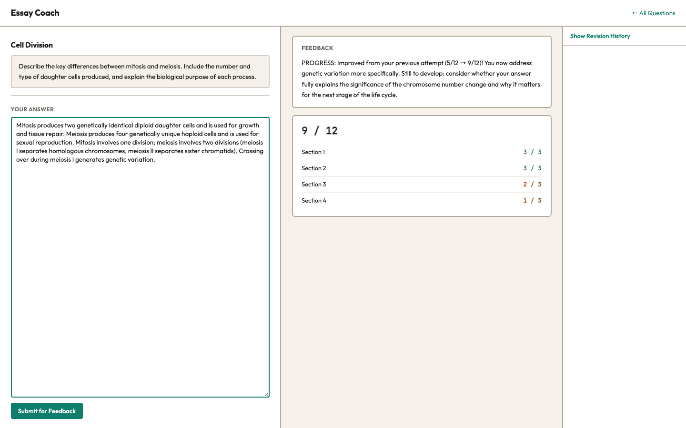

### Using Revision History

Below the workspace, there's a **Show Revision History** toggle. Click it to expand a collapsible list of all your previous attempts, newest first. Each entry shows:

- Your submitted answer text
- The feedback you received
- Your score for that attempt (if the question uses point-value scoring)

Click any attempt's header to expand or collapse it. This helps you track your progress and see how your answer has evolved across revisions.

**Note:** If you're signed in, your history is tied to your account and persists across browsers. If you're anonymous, attempts are tracked by a session ID in your browser's local storage — clearing browser data or switching browsers starts fresh.

### Starting a New Session

If you want to start over on a question from scratch — a fresh attempt chain with no prior history — click **Start new session** in the top-left of the workspace. This creates a new independent session for that question. Your previous sessions are not deleted; they remain archived in your revision history.

Revision history groups attempts by session. Click a session header to expand or collapse it. This lets you compare different revision chains side by side.

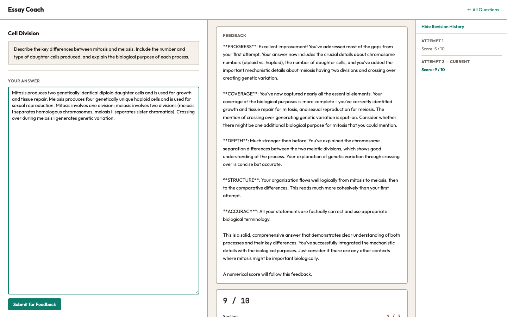

**Note:** The **Start new session** button is only available when you're signed in to a student account. Anonymous users have a single session per question per browser.

---

# Part 2: Developer Guide

## Architecture Overview

Essay Coach is a deliberately simple stack:

```
Browser (vanilla JS) ←→ FastAPI (Python) ←→ SQLite or PostgreSQL
                                          ←→ Anthropic API or Ollama
```

- **Backend**: FastAPI serves both HTML pages (via Jinja2 templates) and a JSON/SSE API.
- **Frontend**: Plain HTML, CSS, and JavaScript — no framework, no build step.
- **Database**: SQLite by default (`essay_coach.db`); PostgreSQL when `DATABASE_URL` is set. `db_connection.py` provides a thin abstraction layer that makes the rest of the code database-agnostic.
- **AI**: Switchable backend via `LLM_BACKEND` env var. `anthropic` (default) uses the Anthropic Python SDK with streaming; `ollama` uses Ollama's OpenAI-compatible `/v1/chat/completions` endpoint via `httpx`.
- **Auth**: Server-side sessions stored in the database. Passwords hashed with bcrypt via passlib. Instructor registration gated by invite code.
- **Production stack**: Docker Compose with four services — `app` (FastAPI on port 8000), `db` (postgres:16-alpine), `nginx` (reverse proxy with TLS termination and SSE support), and `ollama` (optional, profile-gated).

**Configuration is entirely via environment variables.** See `.env.example` for the full list.

## Project Structure

```
essay-coach/
├── app.py                     # FastAPI app — all routes (HTML + API)
├── auth.py                    # Pure crypto: password hashing, token/code generation
├── dependencies.py            # FastAPI auth dependencies
├── feedback.py                # LLM prompt construction and streaming; Anthropic + Ollama backends
├── db.py                      # Database schema and query functions (SQLite + PostgreSQL)
├── db_connection.py           # Database abstraction layer (SQLite/PostgreSQL via DATABASE_URL)
├── export_utils.py            # CSV/JSON formatting helpers for analytics export
├── config.py                  # Environment variables and settings
├── Dockerfile                 # Production container image
├── docker-compose.yml         # Production stack: app, db, nginx, ollama (profile-gated)
├── nginx.conf                 # Reverse proxy config: TLS, SSE support, rate limiting
├── static/
│   ├── style.css              # All styles (CSS custom properties, responsive grid)
│   └── app.js                 # All client-side logic (student + instructor)
├── templates/
│   ├── student.html                      # Student landing/list/workspace (Jinja2, three modes)
│   ├── instructor.html                   # Instructor dashboard (Jinja2)
│   ├── instructor-classes.html           # Class management page (Jinja2)
│   ├── instructor-analytics-class.html   # Class analytics summary page
│   ├── instructor-analytics-question.html # Per-question session detail page
│   ├── login.html                        # Instructor login form
│   └── register.html                     # Instructor registration form
├── tests/                     # Test suite
├── requirements.txt           # Python dependencies
├── .env.example               # Environment variable reference with all options
├── scripts/
│   ├── migrate_to_postgres.py           # One-time SQLite → PostgreSQL migration
│   ├── seed_screenshots.py              # Dev helper: seed sample data for screenshots
│   └── seed_screenshots_quickstart.md  # How to use seed_screenshots.py
└── docs/
    ├── tutorial.md                  # This file
    ├── capture_screenshots.py       # Playwright script: auto-captures all tutorial screenshots
    └── images/                      # Tutorial screenshot PNGs
```

## File-by-File Breakdown

### `config.py`

Loads environment variables from `.env` using `python-dotenv` with `override=True`, so values in `.env` always take precedence over any variables already in the shell environment. Exposes:

- `ANTHROPIC_API_KEY` — required when `LLM_BACKEND=anthropic`.
- `DATABASE_PATH` — SQLite file path; defaults to `essay_coach.db`. Ignored when `DATABASE_URL` is set.
- `DATABASE_URL` — PostgreSQL connection string (e.g. `postgresql://user:pass@db/essay_coach`). When set, the app uses PostgreSQL instead of SQLite.
- `LLM_BACKEND` — `anthropic` (default) or `ollama`.
- `OLLAMA_BASE_URL` — Ollama server URL; defaults to `http://ollama:11434`.
- `OLLAMA_MODEL` — model to use with Ollama; defaults to `llama3.3:70b`.
- `MODEL_NAME` — Anthropic model ID; hardcoded to `claude-sonnet-4-20250514`.

### `auth.py`

Pure cryptographic utilities with no project imports — only stdlib and passlib. This keeps it independently testable and free of circular imports.

| Function | Purpose |
|----------|---------|
| `hash_password(plain)` | Returns a bcrypt hash of the password. |
| `verify_password(plain, hashed)` | Constant-time bcrypt verification. |
| `generate_token()` | Returns a 64-character cryptographically random hex session token. |
| `generate_invite_code()` | Returns a random 8-character uppercase alphanumeric code. Used for both the instructor registration code and class access codes. |
| `compare_codes(a, b)` | Constant-time string comparison via `hmac.compare_digest` — prevents timing attacks on code checks. |

### `dependencies.py`

FastAPI auth dependencies used by instructor-protected routes.

- **`_validate_session(token)`**: Looks up the session in the DB, returns `None` if missing or expired, and slides the 7-day expiry window on each valid access.
- **`require_instructor_api`**: An async FastAPI dependency that reads `session_token` from the cookie and raises HTTP 401 if the session is invalid. Used with `Depends()` on all instructor API routes.
- **`require_class_member`**: An async dependency that chains after `require_instructor_api` and additionally checks that the authenticated instructor is a member of the class referenced in the URL path parameter. Raises HTTP 403 if not a member. Used on all class-scoped routes (`/api/classes/{class_id}/...`).

The `GET /instructor` HTML route imports `_validate_session` directly to redirect to `/login` on failure instead of returning a 401.

### `db_connection.py`

A thin abstraction layer that makes the rest of the codebase database-agnostic.

- `IS_POSTGRES` — a module-level flag set at import time from `DATABASE_URL`. All other modules import this to branch on SQL dialect differences.
- `get_conn()` — returns either a `_SQLiteConn` or a `_PGConn` depending on `IS_POSTGRES`.
- `_SQLiteConn` — wraps `sqlite3`, converting `%s` placeholders to `?` before execution and returning `dict`-like rows from `fetchone`/`fetchall`. Also exposes `execute_raw()` for PRAGMA statements that bypass placeholder conversion.
- `_PGConn` — wraps `psycopg2` with `RealDictCursor`, so rows are plain dicts. Uses `%s` natively.

Both wrappers expose the same interface: `execute(sql, params)`, `fetchone()`, `fetchall()`, `commit()`, `close()`, and `__enter__`/`__exit__` for context manager use.

**Why the `%s` convention?** `db.py` was originally SQLite-only (using `?`). The abstraction layer lets `db.py` use `%s` throughout — the SQLiteConn wrapper converts them to `?` transparently, while PostgreSQL uses `%s` natively.

### `db.py`

Manages all database interactions. Works with both SQLite (via `db_connection._SQLiteConn`) and PostgreSQL (via `db_connection._PGConn`). Key design decisions:

- Query results behave like dictionaries in both backends: SQLite rows are wrapped by `_SQLiteConn`; PostgreSQL uses `RealDictCursor`.
- Foreign keys are enforced: `PRAGMA foreign_keys = ON` for SQLite; PostgreSQL enforces them natively.
- Questions, users, and classes use UUID primary keys (generated in Python).
- `ON DELETE CASCADE` on attempts (via questions), sessions (via users), and class membership (via both users and classes).
- Every function opens and closes its own connection. Simple but not suitable for high concurrency — fine for a local or departmental tool.
- On startup, `init_db()` creates all tables, runs migrations if needed, deletes expired sessions, and seeds the invite code if absent. For PostgreSQL, `_init_db_postgres()` runs a clean `CREATE TABLE IF NOT EXISTS` path — no SQLite-specific migrations.

Functions — questions and attempts:

| Function | Purpose |
|----------|---------|
| `init_db()` | Creates all tables, runs migration, cleans expired sessions, seeds invite code. |
| `create_question(title, prompt, model_answer, rubric, class_id)` | Inserts a new question scoped to a class, returns its UUID. |
| `get_question(id)` | Returns a single question as a dict, or `None`. |
| `list_questions()` | Returns all questions (used internally). |
| `list_questions_for_class(class_id)` | Returns all questions in a given class. |
| `list_questions_for_user(user_id)` | Returns all questions in classes the user is a member of. |
| `update_question(id, **kwargs)` | Updates only the fields you pass, including optionally `class_id`. |
| `delete_question(id)` | Deletes a question and cascades to its attempts. |
| `create_attempt(...)` | Records a student submission and its feedback. Accepts an optional `score_data` dict, serialized to JSON. |
| `update_attempt_score(attempt_id, score_data)` | Updates the `score_data` column for an attempt after scoring completes. |
| `get_attempts(question_id, session_id)` | Returns a student's attempts, newest first. Deserializes `score_data` from JSON. |
| `get_attempt_count(question_id)` | Total submissions across all students. |

Functions — classes:

| Function | Purpose |
|----------|---------|
| `create_class(name, student_code, instructor_code, created_by)` | Inserts a new class, returns its UUID. |
| `get_class(class_id)` | Returns a class dict, or `None`. |
| `get_class_by_student_code(code)` | Looks up a class by its student access code. |
| `get_class_by_instructor_code(code)` | Looks up a class by its instructor invite code. |
| `list_classes_for_user(user_id)` | Returns all classes the user is a member of. |
| `add_class_member(class_id, user_id)` | Adds the user to the class (INSERT OR IGNORE). |
| `is_class_member(class_id, user_id)` | Returns `True` if the user is a member of the class. |
| `get_class_question_count(class_id)` | Total questions in a class. |
| `update_class_student_code(class_id, new_code)` | Rotates the student access code. |
| `update_class_instructor_code(class_id, new_code)` | Rotates the instructor invite code. |
| `get_class_question_stats(class_id)` | Returns one dict per question with aggregate analytics: `total_sessions`, `avg_attempts`, `avg_final_score`, `max_total`, `score_buckets` (low/mid/high counts). Returns `[]` immediately if the class has no questions (avoids an empty `IN ()` SQLite clause). |
| `get_question_session_stats(question_id)` | Returns one dict per student session: `attempt_count`, `score_progression` (list of per-attempt scores, `None` for unscored attempts), `final_score`, `max_total`, and the full `attempts` list. Sorted by `attempt_count` descending. |

Functions — auth:

| Function | Purpose |
|----------|---------|
| `create_user(username, password_hash)` | Inserts a new instructor user, returns UUID. |
| `get_user_by_username(username)` | Returns user dict or `None`. |
| `get_user_by_id(user_id)` | Returns user dict or `None`. |
| `create_session(token, user_id, expires_at)` | Inserts a session row. |
| `get_session(token)` | Returns session if valid and not expired, else `None`. |
| `update_session_expiry(token, expires_at)` | Slides the session window. |
| `delete_session(token)` | Removes a single session (used on logout). |
| `delete_sessions_for_user(user_id)` | Removes all sessions for a user (used on login). |
| `get_setting(key)` | Returns a settings value or `None`. |
| `set_setting(key, value)` | Upserts a settings value. |

#### Migration

When using PostgreSQL (`IS_POSTGRES=True`), `init_db()` calls `_init_db_postgres()` which runs a clean `CREATE TABLE IF NOT EXISTS` path — no ALTER TABLE migrations are needed since PostgreSQL databases are always fresh on first deploy. To migrate an existing SQLite database to PostgreSQL, run `scripts/migrate_to_postgres.py`.

When using SQLite, `init_db()` handles existing databases from earlier phases:

**Phase 3 migration** (pre-classes databases):
1. If `questions` has no `class_id` column, `ALTER TABLE` adds one (nullable, because SQLite cannot add a NOT NULL column without a default).
2. If orphaned questions exist (no `class_id`), a "Default" class is created with auto-generated codes and the first user in the database is added as its member.
3. All orphaned questions are assigned to the Default class.

**Phase 4 migration** (pre-scoring databases):
1. If `attempts` has no `score_data` column, `ALTER TABLE` adds it as a nullable `TEXT` column.

Both migrations are idempotent — they only run when the target column is absent.

### `feedback.py`

The core of the app. Handles LLM communication for both the Anthropic and Ollama backends. Key functions:

**`build_messages(...)`** constructs the user message sent to the LLM. The model answer and rubric are embedded in XML-delimited blocks:

```xml
<model_answer>...</model_answer>
<rubric>...</rubric>
<student_answer attempt="2">...</student_answer>
<previous_feedback>...</previous_feedback>
```

**`generate_feedback_stream(...)`** dispatches to the active backend:
- `LLM_BACKEND=anthropic`: creates an async Anthropic client and streams the response using the Anthropic Python SDK.
- `LLM_BACKEND=ollama`: streams from `OLLAMA_BASE_URL/v1/chat/completions` using `httpx.AsyncClient`, consuming the OpenAI-compatible SSE stream.

Both paths yield text chunks as they arrive, which the API endpoint forwards to the browser via SSE.

The feedback system prompt instructs the LLM to:
1. Never reveal the model answer's content directly.
2. Structure feedback into Coverage, Depth, Structure, Accuracy, and Progress sections.
3. Scale specificity with attempt number (broad early, targeted later).
4. Acknowledge any scoring markers in the model answer without reproducing their values.

**`parse_scored_paragraphs(model_answer)`** splits the model answer on blank lines and extracts any trailing `[N]` point markers (N ≥ 1) using a regex. Returns a list of dicts with `text` and `points` (or `None` for unscored paragraphs).

**`total_points(paragraphs)`** sums the point values of all scored paragraphs.

**`generate_score(paragraphs, student_answer, attempt_number)`** makes a second, non-streaming LLM call after the qualitative feedback stream completes. It sends only the scored paragraphs and the student answer to a strict examiner persona (`SCORING_SYSTEM_PROMPT`) that returns a JSON array of `{paragraph_index, points_awarded, max_points}` objects. Returns `None` on failure (invalid JSON, schema mismatch, out-of-range values) so scoring failures never interrupt the student experience. Dispatches to Anthropic or Ollama based on `LLM_BACKEND`.

### `app.py`

The FastAPI application. Routes are organized into groups:

**HTML routes** (serve pages):
- `GET /` → redirects to `/student`
- `GET /login` → login form
- `GET /register` → registration form
- `POST /logout` → ends session, redirects to `/login`
- `GET /student` → class code entry landing page (mode=`landing`)
- `GET /student/{class_id}` → question list for a class (mode=`list`)
- `GET /student/{class_id}/{question_id}` → writing workspace (mode=`workspace`)
- `GET /instructor` → instructor dashboard with class filter (redirects to `/login` if not authenticated)
- `GET /instructor/classes` → class management page (redirects to `/login` if not authenticated)
- `GET /instructor/classes/{class_id}/analytics` → class analytics summary (404 if class not found; 403 if not a member)
- `GET /instructor/analytics/{question_id}` → per-question session detail (404 if question not found; 403 if not a member of the question's class)

**Auth API routes**:
- `POST /api/auth/register` → validates invite code, creates user and session
- `POST /api/auth/login` → validates credentials, creates session
- `GET /api/auth/me` → returns `{username}` for the logged-in instructor

**Settings API routes** (instructor-protected):
- `GET /api/settings/invite-code` → returns current instructor registration invite code
- `PUT /api/settings/invite-code` → rotates the registration invite code

**Class API routes**:
- `POST /api/classes` → create a class; creator automatically added as member (instructor-protected)
- `POST /api/classes/join` → join a class by instructor invite code (instructor-protected)
- `GET /api/classes/by-student-code/{code}` → resolve student code to `{class_id, name}` (no auth)
- `GET /api/classes/{class_id}/settings` → return class name and codes (instructor + member)
- `PUT /api/classes/{class_id}/student-code` → rotate student code (instructor + member)
- `PUT /api/classes/{class_id}/instructor-code` → rotate instructor invite code (instructor + member)

**Questions API routes** (instructor-protected):
- `POST /api/questions` → create question; body requires `class_id`; validates membership
- `GET /api/questions/detail/{id}` → full question data including model answer
- `PUT /api/questions/{id}` → update question; validates membership on old and optionally new class
- `DELETE /api/questions/{id}` → delete question; validates membership

**Student API routes** (unprotected):
- `POST /api/feedback` → stream AI feedback via SSE; after the `done` event, an optional `score` event is emitted if the question has point-value scoring
- `GET /api/attempts/{id}?session_id=...` → attempt history

### `static/app.js`

A single JS file handling both the student and instructor interfaces. Key patterns:

- **Session management**: `getSessionId()` creates a UUID in `localStorage` on first visit. This tracks a student's attempts without requiring login.
- **Class storage**: `essay_coach_class_id` in `localStorage` remembers which class a student last visited. `initStudentLanding()` reads this on the `/student` landing page and auto-redirects if a stored class is present. A `?clear=1` query parameter (issued by the server when a stored class_id is stale) causes `initStudentLanding()` to clear localStorage instead of redirecting.
- **Auth error handling**: `handleAuthError(res)` checks for HTTP 401 responses on instructor fetch calls and redirects to `/login` if found.
- **Class management** (instructor): `createClass()`, `joinClass()`, `rotateStudentCode()`, `rotateInstructorCode()` call the class API routes and update the DOM or reload the page.
- **Class filter** (instructor dashboard): `applyClassFilter()` shows/hides `.question-card` elements based on their `data-class-id` attribute.
- **Student class flow**: `resolveClassCode()` calls the student-code lookup endpoint, stores the class_id, and redirects. `clearClass()` wipes the stored class and returns to the landing page.
- **SSE consumption**: `submitForFeedback()` uses `fetch()` with a `ReadableStream` reader to process Server-Sent Events manually (no EventSource API — this allows POST requests).
- **Markdown rendering**: `formatFeedback()` does lightweight Markdown-to-HTML conversion (bold, headers, lists) for the streamed feedback text.
- **Score rendering**: `renderScore(scoreData, container)` builds the score table HTML from the score event payload. Called with `null` container for the live workspace (uses `getElementById`), or with a specific element for history cards.
- **History loading**: `loadAttemptHistory()` fetches past attempts from the API and renders collapsible cards, including score tables for any attempts that have score data.

### `static/style.css`

Vanilla CSS using custom properties (CSS variables) for theming. Key layout decisions:

- The student workspace uses `CSS Grid` with two equal columns (left: writing, right: feedback).
- The instructor page uses the same two-column grid (left: form, right: question list).
- The class management page uses a two-column grid for the Create/Join action forms, collapsing to one column on mobile.
- Auth pages (login, register) use a centered card layout (`max-width: 420px`).
- Mobile breakpoint at 768px collapses both layouts to single-column.
- Theming uses a warm cream base (`--bg: #f5f1ea`) with dark teal accents (`--teal: #0d7d6c`) and 2px solid borders throughout — the "Blackboard" theme.
- Class badges (`.class-badge`) use a teal pill style (`var(--teal-light)` background, `var(--teal-dark)` text, `var(--teal-mid)` border).
- Score section (`.score-section`, `.score-total`, `.score-breakdown`, `.score-label`, `.score-fraction`) styles the score table shown below feedback.
- Analytics pages (`.analytics-page`, `.analytics-table`, `.analytics-tiles`, `.analytics-tile`, `.score-dist-bar`, `.score-dist-seg`, `.score-high/mid/low`) style the class summary and session detail pages.
- System font stack — no external fonts or CSS frameworks.

## The Feedback Engine

This is how a student submission turns into feedback:

```
Student clicks "Submit"
    → Browser POSTs to /api/feedback
        → Server looks up question (model_answer, rubric)
        → Server parses model answer for [N] point markers
        → Server calls build_messages() to construct the prompt
        → Server opens streaming connection to LLM (Anthropic or Ollama)
        → Each text chunk is forwarded to browser via SSE
        → Browser renders chunks in real-time
        → When stream ends, server saves attempt to database
        → Browser receives "done" event, reloads history
        → If question has point markers, server calls generate_score()
            → Non-streaming LLM call returns JSON score data
            → Server stores score on the attempt row
            → Browser receives "score" event, renders score table
```

The system prompt is critical. It tells Claude to act as an essay coach with strict rules about never revealing the model answer. The key constraint is **directional feedback**: instead of saying "you should mention X," the AI says "consider whether your discussion of X is complete."

The prompt also instructs Claude to **scale specificity with attempt number**. On attempt 1, feedback is broad ("you're missing some key concepts in area X"). By attempt 4, it's much more targeted ("your discussion of X is solid but doesn't address the relationship between X and Y").

## Security Model

### Model answer protection

The central security constraint: **the model answer must never reach the student's browser**.

This is enforced at multiple layers:

1. **HTML routes**: When rendering student pages, the server constructs a `safe_question` dict containing only `id`, `title`, and `prompt`. The model answer and rubric are never passed to the template.

2. **API responses**: The `/api/feedback` endpoint returns only the feedback text via SSE — never the model answer or rubric. The `/api/attempts` endpoint returns only `student_answer` and `feedback`.

3. **Server-side only**: The model answer is passed to the LLM via the Anthropic API call. It exists only in server memory during the request. The LLM's system prompt forbids it from quoting or paraphrasing the model answer.

4. **Protected endpoint**: `GET /api/questions/detail/{id}` returns the full question including model answer, but requires an authenticated instructor session.

5. **Class membership check on delete**: `DELETE /api/questions/{id}` validates that the requesting instructor is a member of the question's class before deleting it.

### Class access control

- **Student access**: Students enter an 8-character code to discover their `class_id`. No login required. The class_id is stored in localStorage and used for subsequent page loads.
- **Instructor class membership**: Class-scoped operations (`GET/PUT /api/classes/{class_id}/...`) use the `require_class_member` dependency, which chains after `require_instructor_api` and checks the `class_members` table. Non-members receive HTTP 403.
- **Question scoping**: Creating or editing a question validates that the instructor is a member of the target class. The instructor dashboard (`GET /instructor`) only shows questions from classes the instructor belongs to.
- **Code rotation**: Both student and instructor codes can be rotated independently. Rotation generates a new unique 8-character code using `generate_invite_code()` with collision detection across all classes.
- **Instructor code comparison**: Joining a class by instructor code uses `compare_codes` (constant-time, wrapping `hmac.compare_digest`) to prevent timing attacks.

### Instructor authentication

- Passwords are hashed with bcrypt (via passlib). The raw password is never stored.
- Sessions use a 64-character cryptographically random token stored in an `HttpOnly`, `SameSite=Lax` cookie. The token cannot be read by JavaScript.
- Sessions have a 7-day sliding expiry window — each authenticated request extends the session.
- On login, all existing sessions for the user are deleted, preventing session accumulation.
- Invite codes are compared using `hmac.compare_digest` (constant-time) to prevent timing attacks.
- Password length is validated server-side to 8–72 characters (bcrypt silently truncates at 72 bytes).
- The `POST /logout` route prevents CSRF-via-GET (an `` tag cannot log out an instructor).

**Note on HTTPS:** The session cookie does not set the `Secure` flag, which is intentional for local HTTP development where the app is accessed over plain HTTP. In the Docker production stack, Nginx terminates TLS and the app container is only accessible internally — cookies travel over HTTPS end-to-end even without the flag. For any non-Docker HTTPS deployment, add `secure=True` to the `set_cookie` call in `app.py`'s `_set_session_cookie` helper.

## Database Schema

Seven tables:

```sql
CREATE TABLE classes (
    id TEXT PRIMARY KEY,              -- UUID generated in Python
    name TEXT NOT NULL,               -- e.g. "BIO101 Spring 2026"
    student_code TEXT UNIQUE NOT NULL, -- 8-char code students enter
    instructor_code TEXT UNIQUE NOT NULL, -- 8-char code instructors use to join
    created_by TEXT REFERENCES users(id) ON DELETE SET NULL,
    created_at TIMESTAMP DEFAULT CURRENT_TIMESTAMP
);

CREATE TABLE class_members (
    class_id TEXT REFERENCES classes(id) ON DELETE CASCADE,
    user_id TEXT REFERENCES users(id) ON DELETE CASCADE,
    joined_at TIMESTAMP DEFAULT CURRENT_TIMESTAMP,
    PRIMARY KEY (class_id, user_id)
);

CREATE INDEX idx_class_members_user ON class_members(user_id);

CREATE TABLE questions (
    id TEXT PRIMARY KEY,              -- UUID generated in Python
    title TEXT NOT NULL,
    prompt TEXT NOT NULL,
    model_answer TEXT NOT NULL,
    rubric TEXT,                      -- Optional, one bullet per line
    class_id TEXT NOT NULL REFERENCES classes(id) ON DELETE CASCADE,
    created_at TIMESTAMP DEFAULT CURRENT_TIMESTAMP
);

CREATE TABLE attempts (
    id TEXT PRIMARY KEY,              -- UUID generated in Python
    question_id TEXT REFERENCES questions(id) ON DELETE CASCADE,
    session_id TEXT NOT NULL,         -- Browser-generated UUID
    student_answer TEXT NOT NULL,
    feedback TEXT,
    attempt_number INTEGER NOT NULL,
    score_data TEXT,                  -- JSON: {total, max_total, breakdown:[{text,awarded,max}]}; NULL if no scoring
    created_at TIMESTAMP DEFAULT CURRENT_TIMESTAMP
);

CREATE TABLE users (
    id TEXT PRIMARY KEY,              -- UUID generated in Python
    username TEXT UNIQUE NOT NULL,
    password_hash TEXT NOT NULL,      -- bcrypt via passlib
    created_at TIMESTAMP DEFAULT CURRENT_TIMESTAMP
);

CREATE TABLE sessions (
    token TEXT PRIMARY KEY,           -- 64-char hex (secrets.token_hex(32))
    user_id TEXT NOT NULL REFERENCES users(id) ON DELETE CASCADE,
    expires_at TIMESTAMP NOT NULL     -- 7-day sliding window
);

CREATE INDEX idx_sessions_user_id ON sessions(user_id);

CREATE TABLE settings (
    key TEXT PRIMARY KEY,             -- e.g. "invite_code"
    value TEXT NOT NULL
);
```

The `session_id` on attempts is how the app tracks which submissions belong to which student browser session, without requiring login. Each browser gets a random UUID stored in `localStorage`.

## API Reference

### Auth

| Method | Endpoint | Body | Returns | Auth required |
|--------|----------|------|---------|---------------|
| `POST` | `/api/auth/register` | `{username, password, invite_code}` | `{ok: true}` + cookie | No |
| `POST` | `/api/auth/login` | `{username, password}` | `{ok: true}` + cookie | No |
| `GET` | `/api/auth/me` | — | `{username}` | Yes |

### Settings

| Method | Endpoint | Body | Returns | Auth required |
|--------|----------|------|---------|---------------|
| `GET` | `/api/settings/invite-code` | — | `{invite_code}` | Yes |
| `PUT` | `/api/settings/invite-code` | `{code?}` | `{invite_code}` | Yes |

If `code` is omitted or empty on PUT, a random 8-character code is generated.

### Classes

| Method | Endpoint | Body | Returns | Auth required |
|--------|----------|------|---------|---------------|
| `POST` | `/api/classes` | `{name}` | `{class_id, name, student_code, instructor_code}` | Instructor |
| `POST` | `/api/classes/join` | `{instructor_code}` | `{class_id, name}` | Instructor |
| `GET` | `/api/classes/by-student-code/{code}` | — | `{class_id, name}` | None |
| `GET` | `/api/classes/{class_id}/settings` | — | `{name, student_code, instructor_code}` | Instructor + member |
| `PUT` | `/api/classes/{class_id}/student-code` | — | `{student_code}` | Instructor + member |
| `PUT` | `/api/classes/{class_id}/instructor-code` | — | `{instructor_code}` | Instructor + member |

Error codes: 404 if code not found, 400 if already a member.

### Questions

| Method | Endpoint | Body | Returns | Auth required |
|--------|----------|------|---------|---------------|
| `POST` | `/api/questions` | `{title, prompt, model_answer, rubric?, class_id}` | `{id}` | Instructor + class member |
| `GET` | `/api/questions/detail/{id}` | — | Full question object | Instructor |
| `PUT` | `/api/questions/{id}` | `{title?, prompt?, model_answer?, rubric?, class_id?}` | `{ok: true}` | Instructor + class member |
| `DELETE` | `/api/questions/{id}` | — | `{ok: true}` | Instructor + class member |

`class_id` in `POST` is required. In `PUT`, it optionally reassigns the question to a different class (validates membership on both old and new class).

### Feedback

| Method | Endpoint | Body | Returns | Auth required |
|--------|----------|------|---------|---------------|
| `POST` | `/api/feedback` | `{question_id, student_answer, session_id}` | SSE stream | No |

The SSE stream emits three types of events:
- `data: {"text": "chunk of feedback"}` — one per streaming token
- `data: {"done": true, "attempt_number": 3}` — signals feedback completion
- `data: {"score": {...}}` — optional; emitted after `done` if the question has point-value scoring. Payload: `{total, max_total, breakdown: [{text, awarded, max}, ...]}`

### Attempts

| Method | Endpoint | Query Params | Returns | Auth required |
|--------|----------|--------------|---------|---------------|
| `GET` | `/api/attempts/{question_id}` | `session_id` (required) | `{attempts: [...]}` | No |

Each attempt object contains: `id`, `question_id`, `session_id`, `student_answer`, `feedback`, `attempt_number`, `created_at`, `score_data` (object or `null`).

## Frontend Architecture

The frontend is intentionally simple — no framework, no build tools, no npm.

**Templates** (`templates/`): Jinja2 templates that the server renders with context data. The student template supports three modes via a `` block:
- `landing` — class code entry form; no question data passed
- `list` — question cards for a class; `class_id`, `class_name`, and `questions` (stripped of model answers) passed
- `workspace` — writing area and feedback panel; `class_id`, `class_name`, and `question` (stripped) passed

The instructor template receives `questions` (filtered to the instructor's classes), `classes` (for the filter dropdown and form select), and `username`.

**JavaScript** (`static/app.js`): A single file with sections for student and instructor logic. `initStudent()`, `initInstructor()`, `initStudentLanding()`, and `initClasses()` are called from their respective templates. The code uses only modern browser APIs (`fetch`, `crypto.randomUUID`, `ReadableStream`, `localStorage`).

**CSS** (`static/style.css`): All styles in one file. Uses CSS custom properties for colors and spacing, CSS Grid for layout, and a single `@media` breakpoint for mobile.

**No build step.** Edit the files and refresh the browser.

## Extending the App

### Product features
- **Student dashboard** — logged-in students see all their classes and submission history in one place (currently history is per-question only); note that students currently have to re-enter their class code on each new device since class enrollment is stored in localStorage, not their account
- **Class enrollment persistence** — save a student's class associations to their account rather than localStorage, so they survive device switches
- **Password reset** — "forgot password" email flow; shares the email provider dependency with email verification
- **Email verification** — confirm email on registration; shares the email provider dependency with password reset
- **File upload** — accept `.txt`/`.docx` answer uploads in addition to paste
- **Custom LLM settings** — let instructors adjust feedback tone, verbosity, or model per class or question
- **Plagiarism detection** — flag suspiciously similar submissions across students in the same class

### Quality / ops
- **Admin tools** — invite code management, user list, and class overview for a super-admin role; currently all managed via CLI or direct database access
- **Rate limiting** — `/api/feedback` is rate-limited at the Nginx layer (20 req/min per IP by default in `nginx.conf`). For finer-grained per-user throttling, add middleware in `app.py`.
- **PaaS deployment** — the Docker image can also be deployed to Railway, Fly.io, or similar single-instance PaaS platforms with a managed PostgreSQL add-on

### Polish
- **Front-end design** — improve the visual design using Claude's [frontend-design plugin](https://claude.com/plugins/frontend-design)
- **Mobile layout** — the student workspace uses a fixed split layout that is functional but not optimized for small screens
- **Question ordering** — instructors cannot reorder questions within a class; currently displayed in creation order

---

## Troubleshooting

### "Failed to get feedback" error
- If using `LLM_BACKEND=anthropic`: check that your `.env` has a valid `ANTHROPIC_API_KEY` with available credits at [console.anthropic.com](https://console.anthropic.com).
- If using `LLM_BACKEND=ollama`: confirm Ollama is running (`ollama list`) and the model in `OLLAMA_MODEL` has been pulled (`ollama pull llama3.3:70b`). Check `OLLAMA_BASE_URL` matches where Ollama is listening.
- Check the terminal running `python app.py` (or `docker compose logs app`) for error messages.

### Server won't start
- Ensure all dependencies are installed: `pip install -r requirements.txt`
- Check you're using Python 3.9 or later: `python --version`

### Feedback is generic or unhelpful
- Improve your model answer — the more detailed it is, the better the AI can assess gaps.
- Add a rubric to focus the AI on the criteria you care about most.

### Lost my revision history
- History is tied to a browser session ID stored in `localStorage`. Clearing browser data or switching browsers resets it.
- The data still exists in the database. With SQLite:
  ```bash
  sqlite3 essay_coach.db "SELECT * FROM attempts ORDER BY created_at DESC;"
  ```
  With PostgreSQL (Docker):
  ```bash
  docker compose exec db psql -U essay_coach -c "SELECT * FROM attempts ORDER BY created_at DESC;"
  ```

### Forgot the invite code (instructor registration)
- Log in to the instructor dashboard — it's displayed in the Settings section.
- Or retrieve it from the database. With SQLite:
  ```bash
  sqlite3 essay_coach.db "SELECT value FROM settings WHERE key='invite_code';"
  ```
  With PostgreSQL (Docker):
  ```bash
  docker compose exec db psql -U essay_coach -c "SELECT value FROM settings WHERE key='invite_code';"
  ```

### Forgot a class code
- Log in to the instructor dashboard and go to **Manage Classes**. Both the student code and instructor invite code are displayed for each class, with Rotate buttons.

### Forgot my password
- There is no password reset flow. An admin with database access can delete the user row and re-register:
  ```bash
  sqlite3 essay_coach.db "DELETE FROM users WHERE username='alice';"
  ```
  Then register again at `/register` with the current invite code.

---

# Part 3: Development History

Essay Coach was built by [Claude Code](https://claude.ai/claude-code), Anthropic's agentic coding tool, across four development phases. Each phase started with a design spec, produced an implementation plan, and was executed task-by-task using the subagent-driven development workflow: a fresh Claude subagent per task, two-stage review (spec compliance, then code quality) after each, and a final review across the whole implementation before merging.

## Superpowers

The structured workflow described above — brainstorming into specs, specs into plans, plans into subagent-driven execution with per-task review — comes from the **[Superpowers](https://github.com/obra/superpowers)** plugin for Claude Code. Superpowers adds skill-based workflows that turn ad-hoc prompting into a disciplined, reviewable process. Each skill is a plain markdown file describing a procedure (brainstorming, writing plans, executing plans, TDD, code review) that Claude follows step by step.

To use Superpowers on your own Claude Code projects, install it from your terminal (not inside Claude Code):

```bash
claude plugin install superpowers@claude-plugins-official
```

Superpowers is in the [Claude plugin store](https://claude.com/plugins/superpowers).

## Phase 1 — Core App

The first phase built the essential product from scratch: a working feedback loop between students and an AI coach. The original prompt was:

> "i want to make a webapp that runs locally on my university's servers.  the app gives a student structured feedback on their answer to essay questions, and the app has access to model answers written by the class instructor (the student does not have access to the model answer). the idea is for the student to repeatedly revise their answer, using the feedback, and thereby learn the "shape of a good answer". this practice would help them learn how to study for the real essay questions in an exam (where the app would not be available). help me design such an app, starting with a structured prompt to Claude Code"

**What was built:**
- The SQLite schema (`questions`, `attempts`) and all query functions in `db.py`.
- The feedback engine in `feedback.py`: the system prompt, the message construction function (`build_messages`), and the streaming Anthropic API call.
- The FastAPI app (`app.py`) with student and instructor HTML routes and the `/api/feedback` SSE endpoint.
- The student template (`student.html`) with a two-mode design: question list and workspace.
- The instructor template (`instructor.html`) with a form for creating and editing questions.
- `static/app.js` and `static/style.css` — the complete client-side layer.
- A test suite covering the feedback engine and DB functions.

**Key design decisions made in Phase 1:**
- *No student login.* Students are tracked by a UUID stored in `localStorage`. This eliminates friction for students while still persisting attempt history within a browser session.
- *Streaming feedback.* Using SSE rather than a single JSON response means students see the feedback arrive word-by-word, which feels more like getting feedback from a real person.
- *Server-side model answer only.* The model answer is never sent to the client — only to the Anthropic API. This is enforced structurally, not just by policy.
- *Directional hints, not answers.* The system prompt instructs the LLM to guide students toward the right answer without revealing it, and to scale specificity with attempt number.

## Phase 2 — Instructor Authentication

The second phase added a full authentication system so the instructor dashboard could be protected without complicating the student experience.

**What was built:**
- `auth.py`: bcrypt password hashing, cryptographically random session tokens and invite codes, and constant-time code comparison.
- `dependencies.py`: the `require_instructor_api` FastAPI dependency and the `_validate_session` helper used by HTML routes to redirect rather than return 401.
- The `users`, `sessions`, and `settings` tables in `db.py`.
- Auth routes: `POST /api/auth/register`, `POST /api/auth/login`, `GET /api/auth/me`.
- `GET /api/settings/invite-code` and `PUT /api/settings/invite-code` for managing the registration code.
- `login.html` and `register.html` templates.
- Session sliding-window expiry: each authenticated request extends the session by 7 days.
- A comprehensive integration test suite for all auth flows.

**Key design decisions made in Phase 2:**
- *Invite-code gated registration.* Rather than an admin panel, the first instructor gets the code from the terminal or database. They share it to add colleagues. The code can be rotated at any time.
- *HttpOnly cookie sessions.* The session token is inaccessible to JavaScript, preventing XSS-based session theft.
- *Constant-time comparisons.* Invite codes and class codes are compared using `hmac.compare_digest` to prevent timing-based enumeration attacks, even though the app is a local tool.
- *Login invalidates all previous sessions.* A new login clears the user's other sessions, preventing session accumulation without requiring an explicit "log out everywhere" feature.

## Phase 3 — Classes

The third phase introduced a multi-class layer so multiple instructors can run independent courses on the same instance, with students accessing only their own class's questions.

**What was built:**
- Two new DB tables (`classes`, `class_members`) and 11 new query functions in `db.py`.
- A migration in `init_db()` that detects pre-Phase-3 databases and automatically assigns all existing questions to a "Default" class.
- The `require_class_member` dependency in `dependencies.py`.
- Six new class API routes in `app.py`: create class, join class, resolve student code, get settings, rotate student code, rotate instructor code.
- Updated `POST /api/questions` to require a `class_id` and validate membership.
- Updated `PUT /api/questions/{id}` to validate membership on the current class and any target class.
- Updated `DELETE /api/questions/{id}` to validate membership before deletion.
- Updated `GET /instructor` to scope the question list to the instructor's classes and pass class data to the template.
- New `GET /instructor/classes` route and `instructor-classes.html` template.
- Rewritten student routes: `GET /student` (landing), `GET /student/{class_id}` (list), `GET /student/{class_id}/{question_id}` (workspace).
- Rewritten `student.html` with three Jinja2 modes.
- Updated `instructor.html` with class badge on question cards, class filter dropdown, and class select in the create/edit form.
- New class management JS functions in `app.js` for instructor (`createClass`, `joinClass`, `rotateStudentCode`, `rotateInstructorCode`, `applyClassFilter`) and student (`initStudentLanding`, `resolveClassCode`, `clearClass`).
- New CSS classes for class badges, filter dropdown, class management cards, and the student code entry form.
- Two integration test files (`test_classes.py`, `test_classes_integration.py`) with 35 new tests.

**Key design decisions made in Phase 3:**
- *Two codes per class.* Students use a short code to find their class (no login). Instructors use a separate code to join an existing class. Rotating one doesn't affect the other.
- *localStorage for student class.* Students enter their code once; the browser remembers the class. The `?clear=1` redirect pattern breaks any redirect loop when a stored class_id becomes stale.
- *Migration is idempotent.* `init_db()` can safely run on every startup. The Default class migration only fires when orphaned questions exist, ensuring a second run doesn't create a second Default class.
- *SQLite NOT NULL limitation.* SQLite cannot add a NOT NULL column via `ALTER TABLE` without a default. The migration adds `class_id` as nullable via `ALTER TABLE`, then immediately fills all rows. Fresh installs use `CREATE TABLE` with `NOT NULL`.
- *Instructor dashboard scoped to their classes.* `list_questions_for_user` joins through `class_members` so instructors only see questions from classes they belong to — even if other classes exist on the same instance.

## Phase 4 — Quantitative Scoring

The fourth phase added optional numeric scoring so students can track their progress quantitatively alongside qualitative feedback.

**What was built:**
- `parse_scored_paragraphs(model_answer)` in `feedback.py`: regex-based parser that splits the model answer on blank lines and extracts trailing `[N]` point markers (N ≥ 1).
- `total_points(paragraphs)` and `validate_score(data, paragraphs)` helper functions.
- `SCORING_SYSTEM_PROMPT` and `generate_score(paragraphs, student_answer, attempt_number)` in `feedback.py`: a second, non-streaming Anthropic API call using a strict examiner persona that returns a JSON score array.
- `score_data TEXT` nullable column on the `attempts` table, with an idempotent Phase 4 migration in `init_db()`.
- `update_attempt_score(attempt_id, score_data)` in `db.py` to store scores separately from attempt creation (scoring runs after the attempt is saved, so failures don't lose the attempt).
- Updated `create_attempt(...)` signature to accept optional `score_data`.
- Updated `get_attempts(...)` to deserialize `score_data` from JSON.
- Updated `/api/feedback` SSE endpoint in `app.py` to emit an optional `score` event after `done`.
- `renderScore(scoreData, container)` in `app.js`: builds the score table DOM for both live feedback and history cards.
- `.score-section` and related CSS in `style.css`.
- 12 new unit tests in `test_feedback.py` for the parse/validate functions.
- `test_scoring_integration.py` with 3 DB unit tests and 7 FastAPI integration tests using mocked LLM calls.

**Key design decisions made in Phase 4:**
- *Opt-in scoring.* Instructors add `[N]` markers to their model answers only if they want numeric scoring. Questions without markers produce no score event — the UI stays unchanged for them.
- *Scoring after saving.* The attempt is written to the database before `generate_score()` is called. If scoring fails (invalid LLM response, network error), the attempt and qualitative feedback are preserved. `update_attempt_score` patches the row only on success.
- *Graceful degradation.* `generate_score()` returns `None` on any failure — bad JSON, schema mismatch, out-of-range values, or API error. The `score` SSE event is only emitted on success, so students never see an error from the scoring path.
- *N ≥ 1 enforcement.* The regex `\[([1-9]\d*)\]` rejects `[0]` markers. Zero-point sections are meaningless for scoring and could confuse the LLM.
- *Separate LLM call.* Scoring uses a different, tightly constrained system prompt from feedback. Mixing the two concerns in one call would make the prompt more fragile and harder to iterate on independently.

## Phase 5 — Per-Student Analytics

The fifth phase added read-only analytics pages for instructors, surfacing per-session engagement and score data already present in the `attempts` table — no new database tables required.

**What was built:**
- `get_class_question_stats(class_id)` in `db.py`: fetches all attempts for a class in one query, then groups and aggregates in Python. Returns per-question stats: distinct session count, average attempts per session, average final score, max score, and score bucket counts (low/mid/high).
- `get_question_session_stats(question_id)` in `db.py`: fetches all attempts for a question and groups by `session_id`. Returns per-session data: attempt count, score progression (list of per-attempt scores), final score, and the full attempt list with student answers and AI feedback.
- Two new HTML routes in `app.py`: `GET /instructor/classes/{class_id}/analytics` and `GET /instructor/analytics/{question_id}`. Both use the same `_validate_session` + redirect pattern as existing instructor HTML routes, and check class membership before rendering.
- `instructor-analytics-class.html`: class summary table with a color-coded distribution bar (red/yellow/green segments, proportional to bucket counts using CSS flex).
- `instructor-analytics-question.html`: per-session detail table with score progression, color-coded final scores, and a "Show answers" expand toggle. Inline `<script>` — no changes to `app.js`.
- Analytics entry points in `instructor.html`: a class analytics link row below the class filter dropdown, and an **Analytics** button on each question card.
- Analytics CSS appended to `static/style.css`.
- `tests/test_analytics_integration.py`: 13 DB unit tests (including score bucket boundary cases at 0.40 and 0.70) and 8 FastAPI integration tests for auth, 404, 403, and 200 cases.

**Key design decisions made in Phase 5:**
- *No new tables.* All analytics data comes from the existing `attempts` table. `session_id` is already stored on every attempt, so "per student" analytics means "per session" — consistent with the app's no-login student model.
- *Python-side aggregation.* Rather than complex SQL window functions or subqueries, the DB functions fetch rows and group them in Python using `defaultdict`. Simpler to test, easier to read, and fine for the expected data volume of a local tool.
- *Truthy guard for score_data.* `if d.get("score_data"):` rather than `is not None` — matches the existing `get_attempts` pattern and handles empty strings left by some migration paths.
- *Empty IN() guard.* `get_class_question_stats` returns `[]` immediately when a class has no questions. SQLite raises a syntax error on `WHERE question_id IN ()` with an empty list.
- *Score progression preserves None.* Unscored attempts produce `None` entries in `score_progression` rather than being omitted, so the list length always equals `attempt_count` and the template can join all entries uniformly.
- *Dedicated analytics pages.* Rather than a modal or inline expansion on the dashboard, analytics get their own bookmarkable URLs, following the same pattern as `/instructor/classes`.

## Phase 6 — Analytics Export

The sixth phase added CSV and JSON download links to both analytics pages, letting instructors pull session data into spreadsheets for offline analysis.

**What was built:**
- `export_utils.py`: pure-Python formatting module with `format_question_export(sessions, fmt)` and `format_class_export(session_rows, fmt)`, both returning `(content, media_type)`. No FastAPI imports — trivially unit-testable in isolation.
- Two new export routes in `app.py`: `GET /instructor/analytics/{question_id}/export` and `GET /instructor/classes/{class_id}/analytics/export`. Both accept a `format` query parameter (`csv` default, `json` optional); unknown values silently fall back to CSV.
- `_make_export_response(content, media_type, basename)` helper in `app.py`: derives the file extension from `media_type` and sets `Content-Disposition: attachment` to trigger a browser download.
- Export link pairs (**CSV** and **JSON**) added to both analytics templates, right-aligned in the header using `margin-left: auto` in a flex row. Hidden when no data exists.
- `tests/test_export_utils.py`: 15 unit tests for the formatting module.
- 14 new integration tests appended to `tests/test_analytics_integration.py`.

**Key design decisions made in Phase 6:**
- *`export_utils.py` is FastAPI-free.* Keeping all formatting logic in a plain Python module makes it trivially unit-testable without spinning up the FastAPI app or a database.
- *Empty string instead of null for unscored fields.* Both CSV and JSON output use `""` for missing scores so spreadsheet tools don't encounter mixed-type columns.
- *Extension derived from media_type.* The `_make_export_response` helper reads the actual `media_type` returned by the formatter to set the filename extension, eliminating any possibility of a mismatch between file contents and filename.
- *Silent CSV fallback.* Unknown `format` values produce CSV output without raising a 400, keeping the API forgiving for future format additions.

## Phase 7 — Student Accounts

The seventh phase added optional student login so students can preserve their revision history across browsers and devices.

**What was built:**
- `student_users` and `student_sessions` tables in `db.py`, with functions: `create_student_user`, `get_student_by_username`, `get_student_by_email`, `get_student_by_id`, `create_student_session`, `get_student_session`, `update_student_session_expiry`, `delete_student_session`.
- `auth.py` extended with `hash_password` and `verify_password` (bcrypt via passlib, already present for instructor auth).
- Four new API routes in `app.py`: `POST /api/student/auth/register`, `POST /api/student/auth/login`, `GET /api/student/auth/me`, `POST /api/student/auth/logout`.
- `_validate_student_session` helper in `app.py` that validates the `student_session_token` cookie and applies sliding-window expiry (7-day extension on each authenticated request).
- Rewritten student landing page in `student.html`: a two-step flow — auth panel (sign in / create account / continue anonymously) followed by the class code panel.
- `initStudentLanding()` in `app.js`: shows student identity in the class code panel; wires the auth buttons.
- `student-identity` display in the workspace showing the logged-in username (or "anonymous").
- An idempotent `init_db()` migration that adds `student_users` and `student_sessions` tables to existing databases.
- `tests/test_student_auth.py`: 18 integration tests covering register, login, logout, `/me`, session expiry, and sliding-window extension.

**Key design decisions made in Phase 7:**
- *Opt-in login.* Anonymous use remains fully supported. Students who don't log in get a UUID-based session in `localStorage` exactly as before — nothing regresses.
- *HttpOnly cookie sessions.* The `student_session_token` cookie is HttpOnly, preventing XSS-based theft.
- *Sliding-window expiry.* Each authenticated request extends the session by 7 days, so active students stay logged in indefinitely without a hard timeout.
- *Separate student and instructor session tables.* Student sessions use `student_sessions`; instructor sessions use `sessions`. The two auth paths are independent and don't share middleware.

## Phase 8 — Multiple Student Sessions

The eighth phase let students explicitly start a fresh revision chain for the same question, with old sessions archived and viewable.

**What was built:**
- `session_number INTEGER NOT NULL DEFAULT 1` column added to `student_question_sessions` via a SQLite table-rebuild migration in `init_db()` (SQLite cannot drop constraints directly; the migration creates a new table, copies rows, drops the old, renames the new). Existing rows are assigned `session_number = 1`.
- Updated `get_or_create_question_session` in `db.py` to return the latest session (by `session_number DESC`) rather than relying on the old unique constraint.
- `start_new_question_session(student_id, question_id) -> tuple[str, int]` in `db.py`: inserts a new session row with `MAX(session_number) + 1`.
- `list_question_sessions(student_id, question_id) -> list[dict]` in `db.py`: returns all sessions for a student/question pair, ordered by `session_number ASC`.
- Two new API routes in `app.py` (registered before `GET /{question_id}` to avoid route collision): `POST /api/student/session/{question_id}/new` and `GET /api/student/session/{question_id}/list`. Both require student auth.
- `start-new-session` button in `student.html` workspace, hidden by default, shown only for authenticated students.
- `_allSessions` sentinel in `app.js` (`null` = anonymous/unfetched, `[]` = authenticated with no sessions yet) to distinguish the anonymous and authenticated paths cleanly.
- `startNewSession()` in `app.js`: calls `POST /new`, updates `_resolvedSessionId` and `_allSessions`, re-renders history.
- Rewritten `loadAttemptHistory()` in `app.js`: authenticated path fetches all sessions via `GET /list`, then fetches per-session attempts in parallel with `Promise.all`, and renders collapsible session groups. Anonymous path renders a flat attempt list as before.
- Session group CSS in `style.css`: `.session-group`, `.session-group-header`, `.session-group-body`, `.session-group.expanded`.
- 14 new tests appended to `tests/test_student_auth.py` covering DB functions, HTTP routes, auth guards, 404 cases, and attempt isolation between sessions.

**Key design decisions made in Phase 8:**
- *Student-controlled sessions.* Only the student can start a new session — instructors have no control over this. The button only appears for logged-in students.
- *Append-only, latest-wins.* No `is_active` flag. The active session is always the one with the highest `session_number`. This avoids update races and keeps the schema simple.
- *Sessions are isolated.* Attempts are scoped to `session_id`. A new session starts with zero attempts — previous sessions' history is visible but does not affect the AI's feedback for the new chain.
- *SQLite table-rebuild migration.* The old schema had `UNIQUE(student_id, question_id)`; the new schema needs `UNIQUE(student_id, question_id, session_number)`. Since SQLite cannot drop constraints via `ALTER TABLE`, the migration rebuilds the table. `PRAGMA foreign_keys = OFF` guards against orphaned-row errors in test scenarios.
- *`Promise.all` for parallel fetches.* History renders by fetching all session attempt lists concurrently rather than sequentially, with per-fetch error handling so a single failed request doesn't blank the entire history panel.

## Phase 9 — Production Deployment

The ninth phase prepared the app for deployment on a university server: PostgreSQL support, a switchable LLM backend (Ollama), a Docker Compose production stack, and a one-time migration script for existing SQLite databases.

**What was built:**
- `db_connection.py`: a thin abstraction layer with `_SQLiteConn` (wraps sqlite3, converts `%s`→`?`, returns dict rows) and `_PGConn` (wraps psycopg2 with `RealDictCursor`). `IS_POSTGRES` is set at import time from `DATABASE_URL`. `get_conn()` dispatches to the right backend.
- `db.py` refactored to use `db_connection`: replaced all `?` placeholders with `%s`; replaced `INSERT OR IGNORE` with `INSERT INTO ... ON CONFLICT DO NOTHING`; replaced `datetime('now')` in session queries with a Python datetime parameter; added `_init_db_postgres()` for a clean `CREATE TABLE IF NOT EXISTS` path on fresh PostgreSQL databases (no SQLite-specific ALTER TABLE migrations needed).
- `feedback.py` extended with `_ollama_feedback_stream()` (streams from Ollama's `/v1/chat/completions` via `httpx.AsyncClient`) and `_ollama_score()` (non-streaming equivalent). `generate_feedback_stream()` and `generate_score()` both dispatch on `LLM_BACKEND`.
- `config.py` extended with `DATABASE_URL`, `LLM_BACKEND`, `OLLAMA_BASE_URL`, `OLLAMA_MODEL`.
- `.env.example` updated to document all env vars with explanations.
- `requirements.txt` extended with `psycopg2-binary==2.9.10` and `httpx>=0.27.0`.
- `Dockerfile`: python:3.12-slim image, installs `libpq5`, runs uvicorn on port 8000.
- `docker-compose.yml`: four services — `app`, `db` (postgres:16-alpine with healthcheck), `nginx`, `ollama` (profile `ollama`, optional).
- `nginx.conf`: HTTP→HTTPS redirect, TLS termination, `proxy_buffering off` on `/api/feedback` for SSE, rate limit zone (20 req/min per IP) on `/api/feedback`.
- `.dockerignore`: excludes `.env`, `*.db`, `__pycache__`, `.git`, `docs/`, `*.md`.
- `scripts/migrate_to_postgres.py`: one-time migration script that reads an existing SQLite file and writes all rows to PostgreSQL, respecting foreign-key insertion order (settings → users → classes → class_members → questions → attempts → student_users → student_sessions → student_question_sessions).
- New test files: `tests/test_config.py`, `tests/test_db_connection.py`, `tests/test_ollama_feedback.py`.
- All existing test fixtures updated: monkeypatching changed from `db_module.DATABASE_PATH` (which no longer exists on `db.py`) to `config_module.DATABASE_PATH` (the canonical source of truth read by `db_connection.py`).

**Key design decisions made in Phase 9:**
- *`%s` as the common placeholder dialect.* Both backends use `%s` in `db.py`. The `_SQLiteConn` wrapper converts to `?` transparently, so no query strings needed to change per backend.
- *Module-level `import config as _config` in `db_connection.py`.* Capturing the config module object at import time (rather than looking it up via `sys.modules` on each call) ensures that monkeypatching `config_module.DATABASE_PATH` in tests is visible to `get_conn()` even after `test_config.py` reloads the config module.
- *`_init_db_postgres` skips SQLite migrations.* PostgreSQL databases are always fresh on first deploy; there is no need to ALTER TABLE for Phase 3/4/7/8 columns. The clean `CREATE TABLE IF NOT EXISTS` path is simpler and more reliable.
- *Ollama via OpenAI-compatible endpoint.* Ollama's `/v1/chat/completions` is structurally identical to the OpenAI API, so the integration uses `httpx` with standard SSE parsing rather than a dedicated Ollama library. This keeps the dependency footprint small.
- *`ollama` service is profile-gated.* `docker compose up -d` starts the three core services (app, db, nginx). Adding `--profile ollama` starts Ollama too. This avoids pulling a large Ollama image for deployments that use the Anthropic API.
- *Rate limiting at Nginx.* The 20 req/min limit on `/api/feedback` protects both the LLM API quota and the server from runaway clients. The limit is per source IP and configurable in `nginx.conf`.
